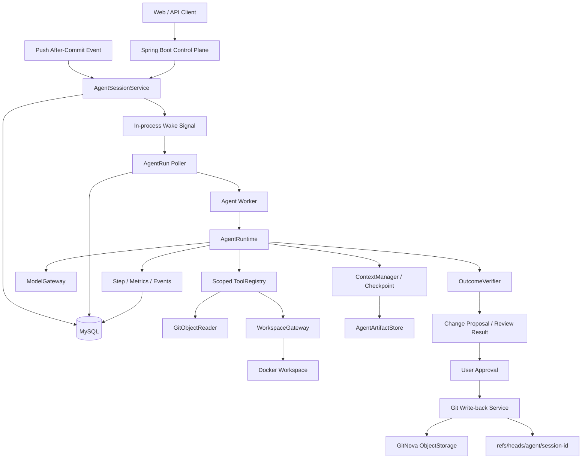

# GitNova — Git-native Cloud Coding Agent Platform
## Project Specification v5.0 — Final Delivery Baseline

> 状态：目标交付规范，不代表文中能力已经全部实现  
> 冻结日期：2026-08-16  
> 适用分支：`refactor/agent-harness-v4-clean` 及其后续交付分支  
> 默认技术栈：Java 17、Spring Boot 3、MySQL 8、Docker、GitNova ObjectStorage  
> 规范语言：`MUST` 表示最终交付必须满足；`SHOULD` 表示时间允许时完成；`ROADMAP` 只描述演进方向。

---

## 0. 文档定位

本规范是 GitNova 最终产品边界与工程交付基线。后续普通功能调整通过 Issue、ADR 和测试契约管理，
不再因为每次小改动继续创建新的“第 N 版架构”。只有产品边界发生根本变化时，才修改本规范的主版本。

SPEC v5 将旧的“Repository-aware Code Review Agent”扩展为：

> **一个以 Git 仓库和不可变 Revision 为可信边界、在服务端隔离 Workspace 中自主研究、修改、测试代码，
> 并通过人工审批将结果写入 Agent Branch 的 Cloud Coding Agent 平台。**

自动 Code Review 仍然保留，但它是 `REVIEW` 任务类型，不再决定整个 Runtime 的抽象。

### 0.1 最终交付原则

1. GitNova 是 Cloud Coding Agent，不是一次 LLM API 调用。
2. Harness 核心是 `Loop + Context + Governance + Durable Execution + Workspace`。
3. 模型只产生决策；仓库身份、Revision、权限、预算和副作用由服务端控制。
4. Coding Task 必须具备读、写、测试能力，但所有副作用都发生在隔离 Workspace。
5. 模型不能直接写数据库、Git 分支或宿主机文件。
6. MySQL 是 Session/Run/Checkpoint 的事实源；Spring Event 只能唤醒 Worker。
7. Context Compression 和 Resume 是主线能力，不是完成 Runtime 后再考虑的装饰功能。
8. 用户分支不被 Agent 直接覆盖；最终写回必须经过 Change Proposal 和用户批准。
9. 默认部署保持模块化单体；不为简历关键词强行引入微服务、Kafka、Temporal 或 Kubernetes。
10. 简历只能描述通过测试和演示验收的能力。

---

## 1. 产品范围

### 1.1 一句话定义

GitNova 是一个 **Git-native Server-side Cloud Coding Agent Platform**：

- Git 托管层提供内容寻址对象、Commit DAG、对象协商、SHA 完整性校验和 CAS 分支更新；
- Control Plane 持久化 Session/Run/Step，调度 Agent Worker，执行权限和配额策略；
- Agent Harness 调用模型、分发工具、构造与压缩 Context、验证终止结果；
- Workspace Runtime 在 Docker 中隔离文件修改、命令和测试；
- Change Proposal 保存 Diff、验证记录和风险，批准后写入独立 Agent Branch。

### 1.2 支持的任务类型

```java
public enum AgentTaskType {
    CODING,
    REVIEW
}
```

#### CODING【MUST】

用户显式提交自然语言任务，Agent：

```text
理解任务 → 探索仓库 → 制定/更新工作计划 → 修改 Workspace
→ 运行测试或验证 → 检查最终 Diff → finalizeTask
→ Change Proposal → 用户批准 → Agent Branch Write-back
```

#### REVIEW【MUST，允许在 Coding 闭环后迁移】

由 Push 事件或用户手动触发，Agent：

```text
读取 BASE→TARGET Diff → 按需搜索和读文件 → finalizeReview
→ ReviewVerifier → 幂等保存 Review Issues
```

REVIEW 不获得写工具，不创建 Change Proposal，不修改分支。

### 1.3 用户驱动与自动触发

- `CODING`：只能由经过认证且拥有仓库权限的用户显式创建。
- `REVIEW/MANUAL`：用户显式创建。
- `REVIEW/PUSH_AUTO`：成功 Push 事务提交后，依据确定性 TriggerPolicy 创建。
- 自动任务不得获得比触发者更高的仓库权限。
- 自动 Review 失败不回滚已成功的 Push。
- 未经用户批准，任何任务都不得修改用户分支。

### 1.4 Non-goals

最终交付不要求：

- 多 Agent 团队协作；
- 跨仓库写操作；
- 自动 Merge；
- 生产级 Kubernetes Workspace Pool；
- Kafka/RabbitMQ；
- Temporal；
- 长期用户记忆；
- 通用网页浏览器；
- 默认开放外网；
- 在 GitNova 核心中引入 LangChain/LangGraph；
- 宣称未经测量的高并发或 Benchmark 数据。

RepoAgent 作为独立 Python/LangGraph/RAG 项目开发，未来只通过只读 `repoResearch` 工具接入。

---

## 2. 参考架构与借鉴边界

| 参考 | 借鉴内容 | 明确不照搬 |
|---|---|---|
| [GitHub Copilot Cloud Agent](https://docs.github.com/en/copilot/concepts/agents/cloud-agent/about-cloud-agent) | 服务端后台任务、仓库研究、分支修改、测试、用户迭代和 PR 式交付 | GitHub Actions 基础设施、GitHub 私有后端、完整产品规模 |
| [VS Code Copilot Source](https://github.com/microsoft/vscode/tree/main/extensions/copilot) | Model/Message/Tool 抽象、Agent Loop、Context 获取、Session/Checkpoint、Subagent 机制 | TypeScript 代码结构、VS Code UI 状态、未开源的 Cloud Control Plane |
| [OpenHands Runtime](https://docs.openhands.dev/openhands/usage/architecture/runtime) | Backend 发出 Action、Sandbox 执行并返回 Observation；Docker 隔离、资源控制、可复现环境 | 完整 Shell 平台、插件生态、镜像构建系统 |
| [Coder Architecture](https://coder.com/docs/admin/infrastructure/architecture) | Control Plane、持久化数据库、Provisioner、Workspace 生命周期分离 | Tailnet、Terraform、多区域部署 |
| [Coder Agent Architecture](https://coder.com/docs/ai-coder/agents/architecture) | Agent Loop 在 Control Plane；模型不直连 Workspace；工具通过受控通道进入 Workspace | Coder 的网络隧道和 Workspace Agent 协议 |
| [Temporal Architecture](https://github.com/temporalio/temporal/blob/main/docs/architecture/README.md) | Durable execution、Worker Poll、历史保留、幂等或不可重试副作用 | Event Sourcing 重放引擎、Temporal Server 和 SDK |

### 2.1 GitNova 自己负责的差异化部分

1. GitNova 自己拥有 Git 对象和 Revision，不依赖外部 GitHub 仓库作为事实源。
2. Repository/Revision/Workspace 身份由服务端注入，不允许模型伪造。
3. Git 对象存储、对象协商、SHA 完整性校验和 CAS 指针更新属于项目既有后端能力。
4. Runtime 与 Tool Contract 使用 Java/Spring Boot 实现，保持 Provider-neutral。
5. Context Checkpoint 与 Session/Run 持久状态融合，而不是只保存聊天记录。
6. Change Proposal 批准后使用 GitNova ObjectStorage 创建对象并更新独立 Agent Branch。

---

## 3. 当前代码基线与迁移纪律

### 3.1 当前可复用能力

| 能力 | 当前状态 | v5 处理 |
|---|---|---|
| Git ObjectStorage / Gitlet Commit、Blob | 已存在，但当前有扁平/分类双目录 | 先统一事实源与对象格式，再补写回 |
| 对象传输、SHA 校验、CAS 设计 | 部分存在，配置和 HEAD 尚未统一 | 保留协议思想，重构执行边界 |
| `ModelGateway` 与 OpenAI-compatible 实现 | 基本完成 | 保留阻塞契约，流式作为适配层 |
| `ModelRequest/Response/Usage/FinishReason` | 已存在 | 保留并补上下文限制 |
| `PromptAssembler/PromptSection` | Review 专用 | 泛化为 Profile-scoped Sections |
| `MessageFactory` | Review 专用初始消息 | 改为基于 Task/Profile 创建 |
| `AgentTool/ToolResult/ToolRegistry` | 基本完成 | 增加 ToolSet 与权限过滤 |
| `listChanges/getDiff/readFile/finalizeReview` | 已存在并有测试 | 作为 REVIEW 工具复用 |
| `ReviewVerifier` | 已存在 | 保留为 REVIEW OutcomeVerifier |
| `AgentRuntime` | 正在手写，Review 专用 | 完成当前逻辑后做小步泛化 |
| Session/Run/Step 持久化 | 未实现 | 新增 |
| Docker Workspace | 未实现 | 新增 |
| Context Manager/Compaction/Checkpoint | 未实现 | 新增 |
| 写工具、测试工具、Change Proposal | 未实现 | 新增 |

### 3.2 必须遵守的迁移纪律

1. 不回滚或覆盖当前未提交的 Runtime 代码。
2. 每次迁移保持项目可编译、相关测试可运行。
3. 先用 FakeModelGateway 锁定现有 REVIEW Runtime 行为，再抽象 Task Profile。
4. 不同时重写 ModelGateway、ToolRegistry、PromptAssembler 和 Runtime。
5. 新 Session 入口稳定前，旧 `CodeReviewListener` 不直接删除；先改为创建持久化 Session。
6. 旧 `CodeReviewAgentLoop` 在新 REVIEW Profile 完成并通过回归测试后再删除。
7. 数据库变更使用单独迁移脚本；不把运行时建表逻辑散落到 Service。
8. 新规范中的类名是职责建议；实现时允许与现有包结构适配，但不得破坏职责边界。

### 3.3 Hosting Consistency Gate【MUST，预计 17–25 小时】

Workspace Materializer、REVIEW Tools 和 Git Write-back 都依赖稳定的 Git 托管事实模型。因此在实现
Session/Workspace 前，现有传输链必须通过本节验收。该工作是 SPEC v5 的前置门槛，不是无边界重写。

#### 3.3.1 当前必须消除的冲突

```text
当前对象布局 A：Gitlet Repository
  .gitlet/objects/commits/{sha}
  .gitlet/objects/blobs/{sha}

当前对象布局 B：ObjectStorage / Transfer / Agent Tools
  .gitlet/objects/{sha}

当前 HEAD A：Gitlet .gitlet/HEAD + branches 文件
当前 HEAD B：repository.head_commit_sha1
当前 HEAD C：branch.head_commit
```

这些路径和指针不能继续同时充当事实源。否则一次成功 Push 后，Negotiation、CAS、Agent Reader 和
Commit Query 可能观察到不同状态。

#### 3.3.2 规范事实源

```text
Git 对象字节       → ObjectStorage(repoKey, sha1)
分支 HEAD          → branch(repo_id, name, head_commit)
默认分支 HEAD 缓存 → repository.head_commit_sha1（可选、非权威）
Commit 查询索引    → commit_record（可重建、非权威）
Gitlet 工作树状态  → 仅遗留本地 CLI，不参与服务端 Negotiation/CAS
```

`ObjectNegotiationService` 禁止继续通过 `GitletService.getHeadSha1()` 获取远端 HEAD。它必须根据
`repoId + branchName` 查询 `branch` 表。`GitletService` 在托管主链中逐步退出，只保留确有用途的
Legacy Adapter；不得再让新的 Workspace/Agent 代码调用 `getRepository()` 读取原生目录。

#### 3.3.3 RepoKey 与存储路径

`repoKey` 是领域标识，不是操作系统路径：

```java
public record RepoKey(long ownerId, long repoId) {
    public String value() {
        return ownerId + "/" + repoId;
    }
}
```

规则：

- 禁止用 `Utils.join()` 构造 RepoKey，避免 Windows `\` 与 Unix `/` 漂移；
- 只允许服务端根据数据库 Repository 构造 RepoKey；
- ObjectStorage 将 RepoKey 解析为受控相对路径，并校验 canonical path 仍位于 storage root；
- SHA 必须满足 `[0-9a-f]{40}`；
- 默认开发路径改为跨平台相对目录，例如 `${REPO_BASE_PATH:./data/repos}`；
- 存储根目录、Workspace 根目录和 Agent Artifact 根目录必须分开配置。

#### 3.3.4 Typed Configuration

禁止在协议实现中继续硬编码 `10000`、`500MB` 或散落 `@Value`：

```java
@ConfigurationProperties(prefix = "gitnova.transfer")
@Validated
public record TransferProperties(
        @Min(1) int maxObjectsPerPush,
        DataSize maxObjectSize,
        DataSize maxPackSize,
        DataSize ioBufferSize
) {}
```

```yaml
gitnova:
  repo:
    base-path: ${REPO_BASE_PATH:./data/repos}
  transfer:
    max-objects-per-push: 10000
    max-object-size: 32MB
    max-pack-size: 128MB
    io-buffer-size: 64KB
```

- `maxPackSize` 是整个请求包语义限制；
- `maxObjectSize` 是单对象限制；
- `ioBufferSize` 只控制流式 IO 缓冲，不改变对象边界；
- Spring Multipart 限制是 HTTP 外层保护，TransferProperties 是协议内层保护，两者必须同时存在；
- 应用启动时验证 `maxObjectSize <= maxPackSize`。

#### 3.3.5 Streaming Pack Decoder

Controller 禁止继续调用 `MultipartFile.getBytes()`。目标接口：

```java
public interface ObjectPackDecoder {
    ValidatedPack decode(
            InputStream input,
            long declaredPackSize,
            TransferProperties limits
    );
}
```

解析流程：

```text
读取 objectCount
→ 校验 0 <= count <= maxObjectsPerPush
→ 对每个对象读取 40-byte SHA + 8-byte length
→ 校验 SHA 格式、非负 length、单对象/累计大小
→ 分块读取内容并增量计算 SHA-1
→ 写入受控临时文件
→ 校验 declaredSha == actualSha
→ 验证 Pack 恰好结束，无尾随字节
→ 全部通过后幂等 Promote 到 ObjectStorage
```

损坏 Pack 必须映射为明确 400 错误，不允许 `BufferUnderflowException`、负数组长度或 OOM 泄漏成500。
临时文件在失败和超时后必须清理。

#### 3.3.6 Safe Git Object Codec

客户端上传的 Commit 是不可信字节。服务端禁止直接使用无过滤的 Java `ObjectInputStream` 反序列化网络对象。
原生 Java Serialization 还会把类字段、JDK 和集合序列化细节耦合进 SHA，不适合作为长期稳定对象格式。

最终目标：

```java
public interface GitObjectCodec {
    byte[] encodeCommit(CommitObject commit);
    CommitObject decodeCommit(byte[] canonicalBytes);
    ObjectType detectType(byte[] canonicalBytes);
}
```

Canonical Commit 格式至少包含：

```text
magic/version
objectType=COMMIT
parentSha1
timestamp
message
按 repository-relative path 排序的 path→blobSha 映射
```

- 所有字符串使用 UTF-8 和确定长度编码；
- Mapping 必须排序，确保相同语义生成相同字节；
- Blob 保留原始内容或使用明确 Type Header，方案一旦选择必须统一；
- SHA 对 canonical bytes 计算；
- Decoder 限制深度、字段长度、文件数和路径长度；
- Commit invariants 校验与解析分开报告。

若为了迁移旧开发数据短期保留 Java Serialization，必须使用严格 `ObjectInputFilter` allowlist 和深度/大小限制，
且只能作为 Legacy Decoder；新写对象一律使用 Canonical Codec。开发数据允许清空重建时，优先直接完成格式切换，
不要长期维护双写。

#### 3.3.7 Branch CAS 与 Fast-forward

`branch` 表是权威分支指针。空仓库不创建虚假的 Gitlet initial commit；第一次 Push 可以没有 branch 行。

```text
First Push
  → INSERT branch(repo_id, name, newHead)
  → 唯一键冲突表示并发创建失败

Existing Branch
  → UPDATE branch
       SET head_commit = newHead
       WHERE repo_id = ? AND name = ? AND head_commit = expectedHead
  → affectedRows == 1 才成功
```

更新前必须验证：

- `newHead` 对象存在且可解码为 Commit；
- Commit mapping 中所有 Blob 存在；
- `newHead` 的祖先链能够到达 `baseHead`；
- branchName 合法；
- `commit_record.message/parentSha1` 来源于 Commit 对象，不信任重复的 Multipart Metadata；
- Push Range 的 BASE 与 TARGET 单独保留给自动 REVIEW，TARGET 的直接 parent 不一定等于 BASE。

`repository.head_commit_sha1` 若保留，只能在默认分支 CAS 成功后同步更新，并明确它是缓存。任何代码不得用它
代替指定 branch 的 HEAD。

#### 3.3.8 Atomic Object Write

LocalObjectStorage 写入必须满足：

```text
validate repoKey/sha
→ 写同目录临时文件
→ fsync/close
→ atomic move（不支持时采用安全 fallback）
→ 已存在对象则比较内容 digest
```

相同 SHA + 相同内容是幂等成功；相同 SHA + 不同内容是完整性错误。禁止直接覆盖已有内容寻址对象。

数据库事务不能回滚文件系统对象。允许失败 Push 留下不可达的内容寻址对象，但必须满足：

- 分支 CAS 是对象可见性的最后边界；
- 不可达对象不会被列表/API误认为 Commit 历史；
- 后续提供按可达性清理孤儿对象的维护任务；
- Repository 删除采用状态机/after-commit cleanup，不在数据库事务中假装文件删除可回滚。

#### 3.3.9 Hosting Gate 验收测试

至少覆盖：

1. 配置值真实改变 max objects/object size/pack size 行为；
2. 截断头部、负长度、超限、非法 SHA、尾随字节都得到确定性错误；
3. SHA 不匹配时分支不更新、临时文件清理；
4. 空仓库第一次 Push 成功；
5. 两个并发 First Push 只有一个成功；
6. 两个客户端基于同一旧 HEAD Push 只有一个 CAS 成功；
7. non-fast-forward 新 HEAD 被拒绝；
8. 多 Commit Push 的 target parent 与 review base 分别正确；
9. Push 后 Negotiation、Branch Query、GitObjectReader 看到同一 HEAD/对象；
10. 同一对象重复上传幂等；
11. ObjectStorage 拒绝 RepoKey/SHA 路径逃逸；
12. 不可信 Commit 字节无法触发任意 Java 类型反序列化；
13. Branch 更新失败不会发布 PostReceiveEvent；
14. Agent REVIEW Tool 能读取刚刚 Push 的 TARGET Commit。

### 3.4 其他重构分类

以下清单只包含当前仍未完成的重构点。已经完成并有测试的 Model DTO、ModelGateway 核心映射、P0 REVIEW
Tools、Tool Schema Validator、ReviewVerifier 等不进入重构清单。

#### R0 — 开始大规模改动前必须完成

| 顺序 | 重构项 | 当前风险 | 目标与验收 | 工时 |
|---:|---|---|---|---:|
| R0-01 | 测试执行基线 | 当前 `mvn test` 在 JDK 21 下因 Mockito 自附加失败；MockWebServer 在受限环境无法监听端口 | 配置受支持的 Mockito MockMaker/Java Agent；区分纯单元测试与需要 loopback 的 Gateway 测试；本地/CI 给出一条可重复的全绿命令 | 1–2h |
| R0-02 | RepoKey 与 Storage Roots | RepoKey 使用 OS Path join；默认路径偏向 Windows；Repo/Object/Artifact/Workspace 根目录未清晰分离 | `RepoKey` 值对象、跨平台配置、canonical root 校验；路径逃逸测试 | 2–3h |
| R0-03 | Canonical GitObjectCodec | 网络 Commit 使用无过滤 Java Serialization；对象字节受类/JDK细节影响 | 确定性 Commit 编码、类型/版本头、排序 mapping、严格 Decoder；新对象不再使用原生序列化 | 4–6h |
| R0-04 | Atomic/Typed ObjectStorage | 直接覆盖对象；`exists→read` 存在 TOCTOU；接口只支持整块 `byte[]`；异常没有稳定分类 | 原子幂等写、单次 read 映射 NOT_FOUND/CORRUPT/TRANSIENT、受限流式写/读或临时对象 Promote | 3–5h |
| R0-05 | TransferProperties + Streaming Pack | 配置未使用、硬编码限制、`MultipartFile.getBytes()`、损坏 Pack 可变成 OOM/500 | Validated Properties、流式 Decoder、总量/单对象/数量/SHA/尾部校验、临时文件清理 | 4–6h |
| R0-06 | Branch HEAD/CAS/Fast-forward | Gitlet/Repository/Branch 三个 HEAD；First Push NULL CAS；Branch update 0 行被忽略 | branch 是唯一事实源；First Push INSERT；已有分支 CAS；祖先链验证；Negotiation 查询相同 HEAD | 4–6h |
| R0-07 | Hosting Integration Tests | 现有 Transfer 只有 Happy Path Spring 测试 | First Push、并发 CAS、多 Commit、损坏包、原子对象、刚 Push 对象可被 Agent Reader 读取 | 3–4h |

R0-02 至 R0-07 共同构成 3.3 Hosting Gate，存在代码和测试重叠，模块总工时按 17–25 小时估算，
不能机械累加每行上限。

#### R1 — 公开 Session/Workspace API 前完成

| 顺序 | 重构项 | 当前风险 | 目标与验收 | 工时 |
|---:|---|---|---|---:|
| R1-01 | HTTP Error Contract | Controller 直接返回 `ApiResponse.error(404)` 时真实 HTTP 状态仍可能是 200；通用500回传 `ex.getMessage()` | 领域异常 + `@RestControllerAdvice`；真实 HTTP status、稳定 errorCode、安全 message、requestId | 3–4h |
| R1-02 | Authentication Boundary | 缺少 Authorization 时 Interceptor 直接 `false` 未明确401；JWT异常文本手拼JSON；开发默认Secret可能误入非开发环境 | 统一401响应、构造器注入、Secret长度/环境校验、错误内容不泄露；认证集成测试 | 2–3h |
| R1-03 | RepositoryAuthorizationService | Controller 重复查询 Repository/RepoMember；异步逻辑不能依赖请求 ThreadLocal | 集中 `requireRead/Write/Owner`；HTTP入口解析actorId，Session/Run显式持久化actorId；Worker不读取UserContext | 3–4h |
| R1-04 | Repository Lifecycle | create在DB事务中写文件；delete只删两张DB记录，不清对象/分支/Commit/Session；没有活跃任务保护 | PROVISIONING/READY/DELETING/DELETED 状态或等价补偿；事务后清理；删除前阻止活跃Session | 5–7h |
| R1-05 | Hosting Schema Migration | `commit_record.sha1` 全局主键会阻止不同Repo保存相同SHA；缺少生命周期约束和迁移版本 | `(repo_id, sha1)`唯一性或代理主键；branch/commit/repo关联索引；Flyway/Liquibase或有序迁移脚本 | 3–4h |
| R1-06 | Disable Broken Legacy Routes | CommitController、suggest-message、chat等路由会稳定抛 `UnsupportedOperationException`；旧Listener调用未实现Loop | 在新实现接管前关闭/移除路由和Listener Bean，避免公开500；记录替代API | 1–2h |

R1 中与 Session API、安全加固和 Repository Lifecycle 重叠的工作，合并估算为 12–18 小时。

#### R2 — 随对应 V5 功能迁移，不单独停工清洁

| 顺序 | 重构项 | 迁移时机 | 完成条件 |
|---:|---|---|---|
| R2-01 | Review-only `AgentRunContext/RunState/AgentRunResult` | V5-02 Generic Task Profile | 使用 RevisionScope、通用 Outcome/Profile；Runtime 不 import ReviewDraft/ReviewCoverage |
| R2-02 | PromptSection 全局集合与硬编码 Review Message | V5-03 Prompt/Message Profiles | 按 Profile 选择 Sections；MessageFactory 接受 Task Message |
| R2-03 | ToolRegistry 暴露/执行全部工具 | V5-02/V5-07 | definitions 与 execute 都执行 ToolSet allowlist |
| R2-04 | `CodeReviewListener @Async` 直接执行旧 Loop | V5-05/V5-15 | After-commit 只创建持久化 Session/Run并唤醒Worker |
| R2-05 | 旧 `CodeReviewAgentLoop` 与零散 LLM Service | V5-15 | 新 Runtime/API 回归通过后删除，不保留第二套Gateway/Loop |
| R2-06 | ModelGateway 配置和成功响应上限 | V5-17/V5-19 | Provider Properties统一；成功Body硬上限；流式Adapter不污染Runtime |
| R2-07 | WebSocket开放Origin且无订阅鉴权 | V5-16/V5-17 | 握手认证、允许Origin配置、repo/session ownership；断线REST恢复 |
| R2-08 | 数据库事实与事件发布 | V5-04/V5-05 | 事务提交后再发布；事件丢失由Poller恢复；无内存事件作为事实源 |
| R2-09 | Repo create/delete与Workspace/Artifact清理联动 | V5-06/V5-17 | TTL、幂等Cleanup、活跃Lease保护、重要Artifact先持久化 |
| R2-10 | 零散 `@Value` | 每个模块被触及时 | 新模块统一 validated `@ConfigurationProperties`；旧类删除时自然消失 |

#### R3 — 核心闭环稳定后处理

| 顺序 | 清理项 | 原因 |
|---:|---|---|
| R3-01 | 旧 CRUD Service 从 `ApiResponse` 迁移为领域返回值 | 提升分层，但不应阻塞 Agent/Hosting 核心闭环 |
| R3-02 | Commit Query API 完整实现 | E2E可先通过Branch/Proposal查询；实现前保持路由关闭 |
| R3-03 | 全仓字段注入改构造器注入 | 新代码必须构造器注入；旧Auth代码随触达迁移 |
| R3-04 | 清理失效TODO、旧Phase编号和教学式注释 | 在职责稳定后集中完成，避免注释再次漂移 |
| R3-05 | 统一命名、格式和包移动 | 使用IDE/formatter机械完成，不与业务重构混在一个Commit |
| R3-06 | Redis/Kafka/Kubernetes/微服务 | 仅规模化Roadmap，不属于当前重构债 |

优先级纪律：

```text
R0 未完成 → 不进入 Workspace/Write-back
R1 未完成 → 不把 Session API 作为可交付公网接口
R2 → 必须和对应功能一起完成，禁止单独“大扫除”
R3 → 核心 E2E 全绿后再决定是否投入
```

---

## 4. 总体架构



### 4.1 默认部署形态【MUST】

```text
一个 Spring Boot 进程
├── HTTP/WebSocket Control Plane
├── AgentRun Poller + 有界 Worker Pool
├── AgentRuntime
└── DockerWorkspaceProvider Client

MySQL
├── 业务事实源
├── Durable Run Queue
└── Checkpoint / Trace 索引

本地持久目录
├── Git ObjectStorage
├── Agent Artifact Store
└── Workspace 根目录（仅内部访问）

Docker Engine
└── 每个活跃 Workspace 一个受限容器
```

这是模块化单体，不是单线程应用。服务端可以同时存在多个 Session 和 Run；每个 Run 的状态必须局部化，
不得保存在 Spring Singleton 的可变字段中。

### 4.2 未来规模化方向【ROADMAP，不属于完成声明】

```text
Redis       → 分布式限流、Worker Lease、热状态
Kafka       → 多服务事件分发
S3/MinIO    → Artifact Store
Kubernetes  → Workspace Pool / Resource Quota
独立 Worker → Control Plane 与执行面水平扩展
```

默认实现不依赖这些组件。

---

## 5. 领域模型与生命周期【预计 7–9 小时】

### 5.1 为什么使用 Session → Run → Step

```text
AgentSession = 用户的长期业务意图与交互容器
AgentRun     = Session 的一次具体执行/重试/恢复
AgentStep    = 一次 Model、Tool、Compaction、Validation 或 Harness 事件
```

不额外创建通用 `Task` 表。自动 Review 与用户 Coding 都统一创建 Session，来源由 `origin_type` 区分。

### 5.2 AgentSession

```java
public enum AgentSessionStatus {
    CREATED,
    QUEUED,
    RUNNING,
    WAITING_USER,
    WAITING_APPROVAL,
    COMPLETED,
    FAILED,
    CANCELLED
}
```

Session 固定以下可信身份：

- `sessionId`
- `repoId/repoKey`
- `createdBy`
- `taskType`
- `taskText`
- `originType`
- `baseRevision`
- REVIEW 可额外固定 `targetRevision`
- `requestedBranch`
- `promptProfile`
- `workspaceId`（CODING）

Session 的 `baseRevision` 创建后不可修改。用户后续反馈不会偷偷把 Session 切换到新 HEAD；若要基于新 Revision，
必须创建新 Session 或执行显式 rebase 流程，后者不属于最终交付。

### 5.3 AgentRun

```java
public enum AgentRunStatus {
    QUEUED,
    RUNNING,
    SUCCEEDED,
    PARTIAL,
    RETRYABLE_FAILED,
    FAILED,
    CANCELLED,
    TIMED_OUT
}
```

Run Cause：

```java
public enum AgentRunCause {
    INITIAL,
    USER_FOLLOW_UP,
    AUTO_RETRY,
    MANUAL_RETRY,
    RECOVERY
}
```

`PARTIAL` 的严格语义：

> 本次 Run 没有产生通过 Verifier 的终止结果，但已留下可恢复的 Checkpoint、Workspace 进展或有效证据。

PARTIAL 不携带 `ChangeProposal` 或 `ReviewDraft`，也不伪装为成功。Session 可以基于 Checkpoint 启动后续 Run。

### 5.4 RevisionScope：禁止 null targetSha1 泄漏进 Runtime

```java
public sealed interface RevisionScope
        permits SnapshotScope, DiffScope {}

public record SnapshotScope(String baseSha1) implements RevisionScope {}

public record DiffScope(
        String baseSha1,
        String targetSha1
) implements RevisionScope {}
```

- CODING 使用 `SnapshotScope`，Workspace 从 `baseSha1` 物化。
- REVIEW 使用 `DiffScope`。
- 不再用一个允许 `targetSha1 == null` 的通用 Record 表达两种业务状态。

### 5.5 Workspace 生命周期

```java
public enum WorkspaceStatus {
    REQUESTED,
    PROVISIONING,
    READY,
    IN_USE,
    STOPPED,
    FAILED,
    DELETED
}
```

Workspace 是 Session-scoped；同一时刻最多一个 Run 获得写 Lease。Workspace 每次成功修改后增加
`generation`，测试结果和 Checkpoint 都必须记录对应 generation。

### 5.6 Change Proposal 生命周期

```java
public enum ChangeProposalStatus {
    DRAFT,
    READY_FOR_REVIEW,
    APPROVED,
    REJECTED,
    APPLIED,
    STALE,
    FAILED
}
```

```text
READY_FOR_REVIEW
  ├── user rejects  → REJECTED → 可附反馈启动 USER_FOLLOW_UP Run
  └── user approves → APPROVED → CAS Write-back
                                      ├── success → APPLIED
                                      └── conflict/failure → STALE/FAILED
```

---

## 6. 持久化模型【预计 7–9 小时】

旧 `user/repository/repo_member/commit_record/branch` 保留。新增表必须使用 InnoDB 和明确索引。

### 6.1 agent_session

```sql
CREATE TABLE agent_session (
    session_id          VARCHAR(64) PRIMARY KEY,
    request_key         VARCHAR(128) NOT NULL,
    repo_id             BIGINT NOT NULL,
    created_by          BIGINT NOT NULL,
    task_type           VARCHAR(24) NOT NULL,
    origin_type         VARCHAR(24) NOT NULL,
    task_text           TEXT NOT NULL,
    base_sha1           VARCHAR(40) NOT NULL,
    target_sha1         VARCHAR(40),
    requested_branch    VARCHAR(100),
    prompt_profile      VARCHAR(64) NOT NULL,
    status              VARCHAR(24) NOT NULL,
    current_run_id      VARCHAR(64),
    workspace_id        VARCHAR(64),
    version             BIGINT NOT NULL DEFAULT 0,
    error_code          VARCHAR(64),
    error_message       VARCHAR(1000),
    created_at          DATETIME NOT NULL DEFAULT CURRENT_TIMESTAMP,
    updated_at          DATETIME NOT NULL DEFAULT CURRENT_TIMESTAMP,
    finished_at         DATETIME,
    UNIQUE KEY uk_agent_request (request_key),
    INDEX idx_session_repo (repo_id, created_at),
    INDEX idx_session_status (status, updated_at)
);
```

数据库允许 `target_sha1` 为空是因为 CODING 没有 TARGET；Application Service 必须按 `task_type` 构造
`SnapshotScope/DiffScope`，禁止将空值传入 REVIEW Runtime。

### 6.2 agent_run：同时作为 Durable Queue

```sql
CREATE TABLE agent_run (
    run_id              VARCHAR(64) PRIMARY KEY,
    session_id          VARCHAR(64) NOT NULL,
    attempt_no          INT NOT NULL,
    run_cause           VARCHAR(24) NOT NULL,
    status              VARCHAR(24) NOT NULL,
    worker_id           VARCHAR(64),
    lease_expires_at    DATETIME,
    heartbeat_at        DATETIME,
    next_retry_at       DATETIME,
    latest_checkpoint_id BIGINT,
    model_provider      VARCHAR(50),
    model_name          VARCHAR(100),
    prompt_version      VARCHAR(80),
    total_turns         INT NOT NULL DEFAULT 0,
    total_model_calls   INT NOT NULL DEFAULT 0,
    total_tool_calls    INT NOT NULL DEFAULT 0,
    input_tokens        BIGINT NOT NULL DEFAULT 0,
    output_tokens       BIGINT NOT NULL DEFAULT 0,
    estimated_cost      DECIMAL(12,6) NOT NULL DEFAULT 0,
    termination_reason  VARCHAR(64),
    error_code          VARCHAR(64),
    error_message       VARCHAR(1000),
    started_at          DATETIME,
    finished_at         DATETIME,
    created_at          DATETIME NOT NULL DEFAULT CURRENT_TIMESTAMP,
    UNIQUE KEY uk_session_attempt (session_id, attempt_no),
    INDEX idx_run_poll (status, next_retry_at, created_at),
    INDEX idx_run_lease (status, lease_expires_at)
);
```

### 6.3 agent_step

```sql
CREATE TABLE agent_step (
    id                  BIGINT PRIMARY KEY AUTO_INCREMENT,
    run_id              VARCHAR(64) NOT NULL,
    sequence_no         INT NOT NULL,
    turn_no             INT NOT NULL,
    step_type           VARCHAR(32) NOT NULL,
    step_status         VARCHAR(24) NOT NULL,
    tool_call_id        VARCHAR(128),
    tool_name           VARCHAR(100),
    argument_digest     VARCHAR(64),
    result_status       VARCHAR(32),
    artifact_id         VARCHAR(64),
    result_preview      VARCHAR(2000),
    workspace_generation BIGINT,
    input_tokens        INT,
    output_tokens       INT,
    elapsed_ms          BIGINT,
    error_code          VARCHAR(64),
    created_at          DATETIME NOT NULL DEFAULT CURRENT_TIMESTAMP,
    UNIQUE KEY uk_run_sequence (run_id, sequence_no),
    INDEX idx_step_run_turn (run_id, turn_no)
);
```

`step_type` 至少包含：

```text
RUN_STARTED, MODEL_CALL, TOOL_CALL, CONTEXT_COMPACTION,
CHECKPOINT, VALIDATION, PROTOCOL_FEEDBACK, RUN_TERMINATED
```

### 6.4 agent_checkpoint

```sql
CREATE TABLE agent_checkpoint (
    id                  BIGINT PRIMARY KEY AUTO_INCREMENT,
    session_id          VARCHAR(64) NOT NULL,
    run_id              VARCHAR(64) NOT NULL,
    step_sequence       INT NOT NULL,
    workspace_generation BIGINT,
    checkpoint_schema   VARCHAR(32) NOT NULL,
    summary_json        JSON NOT NULL,
    estimated_tokens    INT NOT NULL,
    created_at          DATETIME NOT NULL DEFAULT CURRENT_TIMESTAMP,
    INDEX idx_checkpoint_session (session_id, id),
    INDEX idx_checkpoint_run (run_id, step_sequence)
);
```

### 6.5 agent_workspace

```sql
CREATE TABLE agent_workspace (
    workspace_id        VARCHAR(64) PRIMARY KEY,
    session_id          VARCHAR(64) NOT NULL,
    repo_id             BIGINT NOT NULL,
    base_sha1           VARCHAR(40) NOT NULL,
    provider_type       VARCHAR(24) NOT NULL,
    provider_ref        VARCHAR(255),
    status              VARCHAR(24) NOT NULL,
    generation          BIGINT NOT NULL DEFAULT 0,
    lease_run_id        VARCHAR(64),
    lease_expires_at    DATETIME,
    last_active_at      DATETIME,
    expires_at          DATETIME,
    error_code          VARCHAR(64),
    created_at          DATETIME NOT NULL DEFAULT CURRENT_TIMESTAMP,
    updated_at          DATETIME NOT NULL DEFAULT CURRENT_TIMESTAMP,
    UNIQUE KEY uk_workspace_session (session_id),
    INDEX idx_workspace_expiry (status, expires_at)
);
```

`provider_ref` 是内部容器/目录引用，不得返回模型或普通客户端。

### 6.6 agent_artifact

```sql
CREATE TABLE agent_artifact (
    artifact_id         VARCHAR(64) PRIMARY KEY,
    session_id          VARCHAR(64) NOT NULL,
    run_id              VARCHAR(64),
    artifact_type       VARCHAR(32) NOT NULL,
    storage_key         VARCHAR(500) NOT NULL,
    content_type        VARCHAR(100),
    size_bytes          BIGINT NOT NULL,
    sha256              VARCHAR(64) NOT NULL,
    preview             VARCHAR(2000),
    created_at          DATETIME NOT NULL DEFAULT CURRENT_TIMESTAMP,
    expires_at          DATETIME,
    INDEX idx_artifact_session (session_id, created_at)
);
```

Agent Artifact 与 Git Object 必须使用不同命名空间。模型 Tool Result、命令日志、Patch 和 Context Summary
不是 Git Commit/Blob，不能混进 Git ObjectStorage 的对象集合。

### 6.7 change_proposal

```sql
CREATE TABLE change_proposal (
    proposal_id         VARCHAR(64) PRIMARY KEY,
    session_id          VARCHAR(64) NOT NULL,
    run_id              VARCHAR(64) NOT NULL,
    repo_id             BIGINT NOT NULL,
    base_sha1           VARCHAR(40) NOT NULL,
    workspace_generation BIGINT NOT NULL,
    status              VARCHAR(24) NOT NULL,
    summary             TEXT NOT NULL,
    patch_artifact_id   VARCHAR(64) NOT NULL,
    validation_json     JSON NOT NULL,
    risk_json           JSON,
    agent_branch        VARCHAR(100),
    result_commit_sha1  VARCHAR(40),
    approved_by         BIGINT,
    approved_at         DATETIME,
    applied_at          DATETIME,
    version             BIGINT NOT NULL DEFAULT 0,
    created_at          DATETIME NOT NULL DEFAULT CURRENT_TIMESTAMP,
    updated_at          DATETIME NOT NULL DEFAULT CURRENT_TIMESTAMP,
    UNIQUE KEY uk_session_generation (session_id, workspace_generation),
    INDEX idx_proposal_status (status, updated_at)
);
```

### 6.8 review_issue

```sql
CREATE TABLE review_issue (
    id                  BIGINT PRIMARY KEY AUTO_INCREMENT,
    session_id          VARCHAR(64) NOT NULL,
    run_id              VARCHAR(64) NOT NULL,
    repo_id             BIGINT NOT NULL,
    target_sha1         VARCHAR(40) NOT NULL,
    file_path           VARCHAR(500) NOT NULL,
    start_line          INT NOT NULL,
    end_line            INT NOT NULL,
    severity            VARCHAR(16) NOT NULL,
    category            VARCHAR(50),
    evidence            TEXT NOT NULL,
    explanation         TEXT NOT NULL,
    suggestion          TEXT,
    confidence          DECIMAL(4,3),
    issue_fingerprint   VARCHAR(64) NOT NULL,
    created_at          DATETIME NOT NULL DEFAULT CURRENT_TIMESTAMP,
    UNIQUE KEY uk_review_issue (session_id, issue_fingerprint),
    INDEX idx_review_run (run_id),
    INDEX idx_review_target (repo_id, target_sha1)
);
```

`issue_fingerprint` 基于规范化路径、行范围、category 和 evidence 计算。Run 重试不得为同一 Session
重复制造相同用户可见问题。

### 6.9 持久化事务边界

- 创建 Session 与首个 QUEUED Run 在同一事务中完成。
- Claim Run 使用条件更新；受影响行数为 1 才拥有执行权。
- 每个 Step 完成后独立持久化，失败不回滚之前轨迹。
- 创建 Checkpoint 后，用 CAS 更新 `agent_run.latest_checkpoint_id`。
- Verifier 接受 CodingDraft 后，创建 Proposal 与更新 Run/Session 在同一事务完成。
- Approve 使用 Proposal `version + status` CAS，防止重复点击产生两个 Commit。
- WebSocket/SSE 事件只在事实事务提交后发布。

---

## 7. Durable Run Worker【预计 5–7 小时】

### 7.1 创建与唤醒

```java
@Transactional
public AgentSession createSession(CreateAgentSessionCommand command) {
    authorization.requireRepositoryWrite(command.actorId(), command.repoId());
    RevisionScope scope = revisionResolver.pin(command);

    AgentSession session = sessionRepository.insertIfAbsent(command, scope);
    AgentRun run = runRepository.enqueueInitial(session);
    afterCommitPublisher.publish(new AgentRunQueued(run.runId()));
    return session;
}
```

Event 只降低轮询延迟。即便应用在事务提交后、Event 发布前崩溃，Poller 仍能找到 QUEUED Run。

### 7.2 Claim 与 Lease

```sql
UPDATE agent_run
SET status = 'RUNNING',
    worker_id = :workerId,
    lease_expires_at = :leaseUntil,
    heartbeat_at = NOW(),
    started_at = COALESCE(started_at, NOW())
WHERE run_id = :runId
  AND status = 'QUEUED'
  AND (next_retry_at IS NULL OR next_retry_at <= NOW());
```

- 只有更新成功的 Worker 才能调用 Runtime。
- Worker 定期续租；完成更新必须带 `worker_id` 条件。
- 旧 Worker 租约失效后返回结果，不得覆盖新 Worker。
- Worker Pool 必须有界；队列满时不无限创建线程。

### 7.3 恢复语义

进程启动或定时 Recovery 扫描：

```text
RUNNING 且 lease_expires_at < NOW()
→ 将旧 Run 标记 RETRYABLE_FAILED
→ 保留旧 Run 与 Step
→ 从最新 Checkpoint 创建新 Run(cause=RECOVERY)
```

系统提供 at-least-once Run 执行，不宣称模型调用 exactly-once。所有真正副作用必须幂等，或使用 CAS 保证至多应用一次。

### 7.4 Retry 分类

| 错误 | Run 行为 |
|---|---|
| HTTP 429、5xx、连接超时 | 指数退避 + jitter，尊重 Retry-After |
| API Key 无效、模型不存在 | FAILED，不重试 |
| Tool Schema 错误 | Observation 返回模型修正，不触发 Run Retry |
| ToolResult `retryable=true` | 表示相同调用在外部状态恢复后可能成功 |
| Path/Permission 拒绝 | 不自动重试 |
| Workspace 短暂启动失败 | Run Retry |
| Verifier 可纠正失败 | 同一 Run 反馈模型，受修正预算限制 |
| Write-back CAS 冲突 | Proposal STALE，不自动覆盖 |

`retryable=true` 不表示“换参数就能成功”。参数可被模型修正属于 `INVALID_ARGUMENT`/protocol correction；
retryable 表示同一逻辑操作由于临时外部故障，稍后重试可能成功。

---

## 8. Runtime Core 与 Task Profile【预计 6–8 小时】

### 8.1 Runtime 必须保持任务无关

Runtime 不应 import `ReviewDraft`、`ReviewCoverage` 或硬编码 `finalizeReview`。任务差异由 Profile 提供：

```java
public interface AgentTaskProfile {
    AgentTaskType taskType();
    String promptProfile();
    Set<String> allowedTools();
    String terminalTool();
    AgentOutcomeVerifier outcomeVerifier();
    ModelMessage initialTaskMessage(AgentExecutionContext context);
}
```

```text
CodingProfile
├── terminalTool = finalizeTask
├── read/write/test ToolSet
└── CodingOutcomeVerifier

ReviewProfile
├── terminalTool = finalizeReview
├── read-only ToolSet
└── ReviewVerifier
```

### 8.2 可信执行上下文

```java
public record AgentExecutionContext(
        String sessionId,
        String runId,
        long actorId,
        long repoId,
        String repoKey,
        AgentTaskType taskType,
        RevisionScope revisionScope,
        String workspaceId,
        long workspaceGeneration,
        Set<String> allowedTools,
        Instant deadline
) {}
```

该对象由 Control Plane 从数据库和授权结果构造。模型 Tool Arguments 永远不能提供：

- repoId/repoKey；
- 原始 SHA；
- workspaceId/providerRef；
- actorId；
- allowedTools；
- deadline 或预算。

### 8.3 核心循环伪代码

```java
public AgentRunResult run(AgentExecutionContext context) {
    AgentTaskProfile profile = profileResolver.resolve(context.taskType());
    RunState state = runStateFactory.restoreOrStart(context);
    ContextWindow window = contextManager.restore(context, profile, state);
    List<ToolDefinition> tools = toolRegistry.definitions(profile.allowedTools());

    trace.runStarted(context);

    while (true) {
        cancellationGuard.check(context.runId());
        budgetController.beforeModelCall(context, state, window);

        PreparedContext prepared = contextManager.prepareForModel(
                context, profile, state, window
        );

        ModelRequest request = requestFactory.create(
                context, prepared.messages(), tools, state.nextRequestId()
        );

        ModelResponse response = modelGateway.complete(request);
        state.recordModelResponse(response);
        trace.modelCompleted(context, state, response);
        window.append(messageFactory.assistant(response));

        ProtocolDecision protocol = protocolPolicy.evaluate(response, profile);
        if (protocol.correctableDeviation()) {
            window.append(messageFactory.harnessFeedback(protocol.feedback()));
            state.recordProtocolCorrection(protocol);
            checkpointPolicy.maybeCheckpoint(context, state, window);
            continue;
        }
        if (protocol.fatal()) {
            return terminate(context, state, protocol.reason());
        }

        for (ToolCall call : protocol.toolCalls()) {
            budgetController.beforeToolCall(context, state, call);
            cycleDetector.assertProgress(call, state);

            ToolExecutionContext execution = toolContextFactory.create(
                    context, state, call
            );
            ToolResult fullResult = toolRegistry.executeScoped(
                    execution, profile.allowedTools(), call
            );

            state.recordToolResult(call, fullResult);
            trace.toolCompleted(context, state, call, fullResult);

            ModelMessage observation = contextManager.toObservation(
                    context, call, fullResult
            );
            window.append(observation);

            if (call.name().equals(profile.terminalTool())) {
                OutcomeVerification verification = profile.outcomeVerifier()
                        .verify(context, state, fullResult);

                if (verification.accepted()) {
                    checkpointService.saveTerminal(context, state, window);
                    return complete(context, state, verification.outcome());
                }
                if (verification.correctable()
                        && state.canCorrectFinalDraft()) {
                    window.append(messageFactory.harnessFeedback(
                            verification.feedback()
                    ));
                    state.recordFinalCorrection();
                    break;
                }
                return terminate(context, state, INVALID_FINAL_DRAFT);
            }
        }

        state.nextTurn();
        checkpointPolicy.maybeCheckpoint(context, state, window);
    }
}
```

### 8.4 Tool Call Batch 规则

- Terminal Tool 必须单独出现。
- Terminal Tool 与普通工具混合时，一个工具都不执行；所有 callId 返回结构化拒绝。
- 普通只读工具可按返回顺序串行执行；最终交付不要求并行 Tool Execution。
- 写工具与命令工具必须串行，因为它们改变 Workspace generation。
- `finishReason == TOOL_CALLS` 且 toolCalls 非空时才进入工具分发。
- `STOP` 且未调用 Terminal Tool 是可纠正协议偏离；修正次数耗尽后才终止。

### 8.5 Runtime Policy

```java
public record AgentRuntimePolicy(
        String model,
        int maxTurns,
        int maxModelCalls,
        int maxToolCalls,
        int maxProtocolCorrections,
        int maxFinalDraftCorrections,
        int maxRepeatedToolCall,
        long maxInputTokens,
        long maxOutputTokens,
        Duration maxElapsed,
        int maxToolObservationBytes,
        int maxCommandOutputBytes
) {}
```

Budget 是 Harness 强制约束，不依赖 Prompt 中模型自觉遵守。

### 8.6 终止原因

```text
TERMINAL_TOOL_SUCCEEDED
INVALID_FINAL_DRAFT
PROTOCOL_CORRECTION_EXHAUSTED
INVALID_MODEL_PROTOCOL
MAX_TURNS_REACHED
MAX_MODEL_CALLS_REACHED
MAX_TOOL_CALLS_REACHED
TOKEN_BUDGET_EXCEEDED
DEADLINE_EXCEEDED
REPEATED_TOOL_CALL
NO_PROGRESS
MODEL_OUTPUT_LENGTH
MODEL_CONTENT_FILTERED
MODEL_GATEWAY_FAILURE
TOOL_EXECUTION_FAILURE
WORKSPACE_FAILURE
CANCELLED
```

`TERMINAL_TOOL_SUCCEEDED` 只表示 Runtime 终止结果通过 Verifier；CODING Session 随后进入
`WAITING_APPROVAL`，还不等于 Git Write-back 已完成。

---

## 9. Prompt 与 Message Assembly【预计 3–4 小时】

### 9.1 Prompt Sections 必须按 Profile 选择

当前 Spring 会把所有 `PromptSection` 注入同一个 List。引入 Coding Prompt 后，不能把 Review/Coding 指令混在一起。

```java
public interface PromptSection {
    String key();
    int order();
    Set<String> profiles();
    String render(PromptRenderContext context);
}
```

推荐 Section 顺序：

```text
10 role
20 task contract
30 trust boundary
40 repository/revision scope
50 workspace policy
60 tool workflow
70 validation policy
80 budget guidance
90 completion contract
```

`order` 只决定同一 Prompt Profile 中稳定的渲染顺序；不是模型优先级，也不是运行状态。

### 9.2 Message 分层

```text
SYSTEM    → 服务端策略、权限边界、完成协议
USER      → 用户任务与用户后续反馈
ASSISTANT → 模型文本和 Tool Calls
TOOL      → 与 toolCallId 配对的 Observation
USER(runtime_feedback) → 无真实 Tool Call 的协议/Verifier反馈
```

工具 Definitions 使用 Model API 的独立 `tools` 字段，不复制进 System Prompt。

### 9.3 初始 Context

CODING 初始消息只包含：

- System Policy；
- 用户任务；
- 仓库基本 Manifest（语言、顶层目录、基础 Revision 标签）；
- Workspace 状态摘要；
- 仓库自定义指令的受限摘要；
- 可用工具定义。

不得一次性把整个仓库或完整大 Diff 塞进 Prompt。Agent 通过工具逐步获取上下文。

### 9.4 Prompt Version

Prompt Version 标识服务端行为模板，例如：

```text
coding-system-2026-08-16
review-system-2026-08-10
```

它不由仓库提供，也不是 Git Revision。仓库自定义指令需要独立记录 digest/version。

---

## 10. ModelGateway【预计 2–3 小时增量工作】

### 10.1 保留统一阻塞完成契约

```java
public interface ModelGateway {
    ModelResponse complete(ModelRequest request);
}
```

Runtime 只依赖完整、归一化后的 `ModelResponse`。Provider JSON、SSE chunk、delta tool call 拼接都属于 Gateway Adapter。

### 10.2 流式兼容【SHOULD，额外 4–6 小时】

流式实现不得迫使 Runtime 直接解析 SSE：

```java
public interface StreamingModelGateway extends ModelGateway {
    ModelResponse stream(
            ModelRequest request,
            Consumer<ModelStreamEvent> observer
    );
}
```

Adapter 将流式事件：

```text
TEXT_DELTA / TOOL_ARGUMENT_DELTA / USAGE / COMPLETED / ERROR
```

聚合为现有 `ModelResponse`，同时将可公开的文本进度发送给 EventPublisher。Runtime 仍只依据最终
FinishReason 和完整 ToolCalls 决策。

### 10.3 HTTP 与截断限制

| 内容 | 默认限制 | 超限语义 |
|---|---:|---|
| Provider 错误正文 preview | 8 KiB | 截断后保存 digest，不泄露响应全部内容 |
| 成功响应 HTTP body | 4 MiB | `RESPONSE_TOO_LARGE`，禁止静默截成合法 JSON |
| 单个 Tool Observation 给模型 | 24 KiB | 外置 Artifact，返回 preview/ref |
| 单次 Command 完整日志 | 2 MiB | Artifact 截断并标记 `truncated=true` |
| 单个实时事件 chunk | 16 KiB | 拆分发送 |

### 10.4 ModelUsage

`ModelUsage` 表示 Provider 对一次模型调用的 token 计量，不是 Agent 内部状态：

```java
public record ModelUsage(
        long inputTokens,
        long outputTokens,
        long cachedInputTokens,
        long reasoningTokens
) {}
```

- Provider 返回 usage 时以 Provider 为准。
- Provider 不返回时允许估算，但必须标记 `estimated=true`。
- Run 总量是每次 ModelUsage 求和；不能用最终上下文长度代替累计用量。

---

## 11. Tool System【预计 9–12 小时】

### 11.1 Scoped Tool Registry

Registry 可以收集所有工具，但暴露和执行都必须经过 Profile ToolSet：

```java
List<ToolDefinition> definitions(Set<String> allowedTools);

ToolResult executeScoped(
        ToolExecutionContext context,
        Set<String> allowedTools,
        ToolCall call
);
```

只在 `definitions()` 过滤不够；攻击者或异常模型仍可能构造未暴露工具名，因此执行路径必须再次校验。

### 11.2 最终工具集

| Tool | REVIEW | CODING | 用途 | 增量工时 |
|---|:---:|:---:|---|---:|
| `listChanges` | ✓ | 可选 | BASE→TARGET 变更 Manifest | 已实现 |
| `getDiff` | ✓ | ✓ | Revision Diff 或 BASE→WORKSPACE Diff | 2h 适配 |
| `readFile` | ✓ | ✓ | 读取受控 Revision/Workspace 行范围 | 2–3h 适配 |
| `listFiles` | ✓ | ✓ | 浏览目录 | 1–2h |
| `findFiles` | ✓ | ✓ | Glob/文件名查找 | 1–2h |
| `searchText` | ✓ | ✓ | 词法搜索，返回文件与行号 | 2–3h |
| `applyPatch` | ✗ | ✓ | 创建、修改、删除文件 | 3–4h |
| `runCommand` | ✗ | ✓ | 在 Sandbox 中构建、测试、Lint | 3–4h |
| `getWorkspaceDiff` | ✗ | ✓ | 获取当前完整变更摘要/分页 Diff | 2–3h |
| `finalizeReview` | terminal | ✗ | 提交 ReviewDraft | 已实现 |
| `finalizeTask` | ✗ | terminal | 提交 CodingDraft | 2–3h |

工时存在重叠，表中单项直接相加会高于模块总工时。

### 11.3 Revision 与 Workspace 参数

模型只能使用逻辑标签：

```text
BASE       → Session 固定的 baseSha1
TARGET     → REVIEW 固定的 targetSha1
WORKSPACE  → 当前 Session Workspace generation
```

工具参数不得接受真实 SHA、repoKey、workspaceId 或宿主机路径。

### 11.4 ToolResult

```java
public record ToolResult(
        ToolStatus status,
        String errorCode,
        String message,
        JsonNode payload,
        boolean retryable,
        boolean truncated,
        String artifactId,
        String nextCursor
) {}
```

- `payload` 是返回模型的结构化业务数据。
- 成功不等于 payload 可以无限大。
- `artifactId` 指向完整结果或日志；模型不能用它任意读取服务器文件。
- Cursor 表示同一语义结果的下一页位置，不是 Git Hunk 内容本身。

### 11.5 applyPatch

推荐参数：

```json
{
  "patch": "*** Begin Patch\n...",
  "expectedGeneration": 3
}
```

规则：

- 使用 `expectedGeneration` CAS，避免基于旧 Workspace 状态覆盖新修改；
- PathGuard 拒绝绝对路径、`..`、NUL、Workspace 外符号链接；
- 限制单次 Patch 文件数和字节数；
- 成功后 generation + 1；
- ToolResult 返回 changedFiles、旧/新 generation 和简短 Diff Stat；
- 完整 Patch 存 Artifact，不重复塞入 Context。

### 11.6 runCommand

命令只能在 Workspace Container 中运行：

```json
{
  "command": "./mvnw -q test",
  "workingDirectory": ".",
  "timeoutSeconds": 120,
  "purpose": "run repository tests"
}
```

规则：

- 不挂载 Docker Socket；
- 默认关闭外网；
- 不注入模型 API Key、数据库密码或宿主机环境变量；
- 限制 CPU、内存、PID、运行时间和输出；
- 命令结束返回 exitCode、duration、stdout/stderr preview、artifactId；
- 记录执行时的 workspaceGeneration；
- 超时要终止整个进程组；
- 命令输出属于不可信仓库内容，不能改变 System Policy。

---

## 12. Workspace Runtime【预计 10–13 小时】

### 12.1 接口边界

```java
public interface WorkspaceProvider {
    WorkspaceHandle provision(WorkspaceSpec spec);
    WorkspaceHandle resume(String workspaceId);
    void stop(String workspaceId);
    void delete(String workspaceId);
}

public interface WorkspaceGateway {
    FilePage listFiles(...);
    FileContent readFile(...);
    SearchPage searchText(...);
    PatchResult applyPatch(...);
    CommandResult runCommand(...);
    WorkspaceDiff diff(...);
}
```

Agent Tool 只依赖 `WorkspaceGateway`，不直接调用 Docker CLI 或读宿主机目录。

### 12.2 Provision 流程

```text
AgentSession(baseSha1)
  → 创建受控 Workspace 目录
  → GitObjectReader 读取 Commit mapping
  → 校验每个 Blob SHA 与路径
  → 物化到 Workspace 根目录
  → 启动 Docker Container
  → 只将该 Workspace 挂载到 /workspace
  → 健康检查
  → Workspace READY
```

物化过程必须直接读取 GitNova ObjectStorage。不得依赖 Gitlet 原生 commits/objects 目录恰好存在副本。

### 12.3 Workspace 安全

- Workspace 根目录必须位于配置的专用根路径；
- 删除前验证 workspaceId、数据库 owner 和 canonical path；
- 不允许递归删除未解析变量、HOME、仓库根或 Workspace 根本身；
- 所有路径解析后必须仍位于 Workspace；
- 拒绝通过 symlink 逃逸；
- 容器使用非 root 用户；
- 默认 `--network none`；
- 设置只读系统文件系统和受限 tmpfs（可行时）；
- 设置 CPU、内存、PID 和 deadline；
- 不挂载宿主机 Git ObjectStorage、MySQL 配置或 Docker Socket。

### 12.4 Workspace 一致性

```text
baseSha1          = 不可变来源
generation        = Workspace 变更版本
latestTestGeneration = 最近一次成功验证针对的版本
```

任何写操作成功后：

```text
generation++
previous validation becomes stale
```

如果进程重启但容器仍存在，Provider 可以 resume；若容器不可用但 Workspace 文件仍完整，可以重新启动容器。
若文件也丢失，只能从最新 Patch/Checkpoint 恢复或将 Run 标记 PARTIAL/FAILED，禁止假装 Workspace 未变化。

### 12.5 Cleanup

- RUNNING/WAITING_APPROVAL 的 Workspace 不自动删除；
- COMPLETED/REJECTED/CANCELLED 后按 TTL 清理；
- Cleanup 是幂等操作；
- 物理删除成功后再将状态置为 DELETED；
- 重要 Patch、日志和 Proposal Artifact 必须在 Workspace 删除前持久化。

---

## 13. Context Engineering【预计 10–14 小时】

### 13.1 Context 不是 Message List 的别名

```java
public record ContextItem(
        String id,
        ContextKind kind,
        int priority,
        boolean pinned,
        int estimatedTokens,
        String sourceRef,
        String digest,
        Long workspaceGeneration,
        String content,
        String artifactId
) {}
```

ContextKind 至少包含：

```text
SYSTEM_POLICY, USER_TASK, USER_FEEDBACK, REPOSITORY_INSTRUCTION,
WORKING_STATE, ASSISTANT_ACTION, TOOL_OBSERVATION, FILE_EVIDENCE,
PATCH_SUMMARY, VALIDATION_RESULT, COMPACTION_SUMMARY
```

### 13.2 Context 分层

```text
Pinned Context
├── System Policy
├── 用户任务与最新反馈
├── Revision/Workspace 逻辑范围
├── Trust Boundary
└── Completion Contract

Working Context
├── 当前计划与进度
├── 相关文件和证据
├── 当前 Workspace Diff 摘要
├── 最近工具调用
└── 未解决问题

Externalized Context
├── 完整命令日志
├── 大 Diff / 大文件
├── 历史 Tool Result
└── 旧 Checkpoint / Trace
```

### 13.3 Token Budget

```text
usableContext = min(providerContextLimit, configuredLimit)
                - reservedOutputTokens
                - safetyMargin
```

默认阈值：

```text
70% → warning，优先外置大结果
80% → 执行 compaction
90% → emergency compaction；失败则 PARTIAL
压缩后目标 ≤ 60%
```

百分比针对 `usableContext`，不是 Provider 宣称的总 context window。

### 13.4 大结果外置

```text
Full Tool Result
   → AgentArtifactStore
   → sha256 + size + artifactId
   → Observation = summary + preview + artifactId + cursor + truncated
```

ArtifactId 是受权限控制的逻辑引用，不是本地文件路径。普通模型不自动拥有任意 Artifact 回读能力。

### 13.5 Compaction 顺序

1. 去除重复错误详情和无进展反馈；
2. 将旧的大 Tool Observation 替换为摘要和 ArtifactRef；
3. 合并重复文件片段，保留更聚焦或更新的范围；
4. 对早期完整交互单元生成结构化 Summary；
5. 保留压缩边界后的最近原始消息；
6. 仍超预算则终止为 PARTIAL，不静默丢关键状态。

必须以完整交互单元处理：

```text
assistant(tool_calls) + all matching tool(tool_call_id)
```

禁止留下孤立 Tool Message 或删除仍未配对的 callId。

### 13.6 结构化 Checkpoint

```java
public record ContextCheckpointState(
        String goal,
        List<String> constraints,
        List<GroundedFact> confirmedFacts,
        List<Hypothesis> hypotheses,
        List<String> importantFiles,
        List<String> changedFiles,
        List<Decision> decisions,
        List<FailedAttempt> failedAttempts,
        List<ValidationRecord> validations,
        List<String> unresolvedQuestions,
        List<String> nextActions,
        List<String> artifactRefs,
        long workspaceGeneration
) {}
```

关键要求：

- `confirmedFacts` 必须带 Step/Artifact/File 引用；
- 假设与事实分字段，压缩不能把猜测升级为事实；
- Validation 必须记录 generation；
- 不保存模型隐藏思维链；
- Summary JSON 必须经过 Schema 校验；
- Checkpoint 是任务状态，不是长期 Memory。

Summary 采用两阶段生成：

```text
阶段一：确定性投影
  → 从 RunState/Steps/Workspace 直接提取文件、generation、测试和 ArtifactRef

阶段二：可选模型归纳
  → 使用无工具、低温度、结构化输出的专用 ModelRequest
  → 只归纳已有事实，不产生新的仓库事实
  → JSON Schema + sourceRef 校验
```

模型归纳失败、超时或输出无效时，Checkpoint 退回确定性投影；不得因为“总结失败”丢失已经持久化的
Workspace、Step 或 Artifact。

### 13.7 Checkpoint 时机

至少在以下时机保存：

- Context Compaction 后；
- Workspace 修改后且达到配置的 Step 间隔；
- 成功测试后；
- Run 因预算、超时、可重试故障终止前；
- Session 进入 WAITING_USER/WAITING_APPROVAL 前。

### 13.8 Resume

Resume 不重放所有历史 Message：

```text
最新 System/Prompt Profile
+ 原始用户任务与最新反馈
+ 最新有效 Checkpoint
+ Checkpoint 之后的 Steps
+ 当前 Workspace generation/diff/validation 状态
→ 新 Run Context
```

若 Prompt Version 已变化，必须记录恢复时实际使用的新版本；不能假装是旧 Run 的无缝继续。

---

## 14. Cycle Detection 与 Progress【预计 3–4 小时】

### 14.1 Tool Fingerprint

```text
SHA-256(toolName + canonicalJson(arguments) + workspaceGeneration)
```

Workspace generation 必须参与写/读工具 fingerprint，否则文件修改后重新读取同一路径会被误判为重复。

### 14.2 Progress Signals

以下任一变化可视为进展：

- 新文件或新行范围进入 Context；
- 新搜索结果；
- Workspace generation 变化；
- 测试结果变化；
- 新的可验证事实或候选修改；
- Proposal/ReviewDraft 修正后通过更多 Verifier 条件。

连续多个 Turn 只有相同 Tool Error、相同参数、相同 Observation Digest 时提前终止 `NO_PROGRESS`。

---

## 15. Coding Outcome、验证与人工审批【预计 9–12 小时】

### 15.1 finalizeTask 只提交 Draft

```java
public record CodingDraft(
        String summary,
        List<String> changedFiles,
        List<ClaimedValidation> validations,
        List<String> risks,
        List<String> followUps
) {}
```

模型填写的 `changedFiles/validations` 只是声明，不是事实。Verifier 必须从 Workspace 和 AgentStep 重新计算。

### 15.2 CodingOutcomeVerifier

Verifier 至少检查：

1. Workspace 存在且属于当前 Session；
2. Workspace generation 与 finalizeTask 时一致；
3. 实际 Diff 非空；
4. 变更路径未越权且不存在 symlink escape；
5. Draft 中 changedFiles 与实际 Diff 一致；
6. 没有超限二进制或大文件；
7. 最近一次成功验证针对当前 generation；
8. 测试命令、exitCode、耗时和日志 Artifact 可追踪；
9. Summary 非空且与实际变更不矛盾；
10. Proposal Patch 可以从 baseSha1 稳定重放。

### 15.3 Validation Policy

默认规则：代码变更必须在最后一次修改之后至少有一次成功验证。

```text
latestSuccessfulValidation.generation == workspace.generation
```

文档-only 任务可以由 Profile 配置允许跳过测试，但必须执行最小 Diff/格式验证，并在 Proposal 中明确标记原因。
如果仓库没有可运行测试，Agent 可以提供 `NOT_RUN` 原因，但 Verifier 不应把它伪装成 `PASSED`；Proposal 标记
`requiresManualValidation=true`。

### 15.4 Proposal 创建

Verifier 接受后：

```text
Workspace Diff → Patch Artifact
Validation Steps → validation_json
CodingDraft + recomputed facts → Change Proposal
Run → SUCCEEDED
Session → WAITING_APPROVAL
```

### 15.5 用户审批

```text
POST /api/agent-sessions/{sessionId}/proposals/{proposalId}/approve
POST /api/agent-sessions/{sessionId}/proposals/{proposalId}/reject
```

- approve/reject 要求仓库写权限；
- 使用 Idempotency-Key 和 Proposal version CAS；
- approve 前重新检查 Proposal generation、baseSha1 和 Artifact digest；
- reject 可携带反馈并选择是否启动 USER_FOLLOW_UP Run。

### 15.6 Git Write-back

批准后：

```text
读取 base Commit mapping
→ 对 Workspace Diff 创建/复用 Blob
→ 构造新 Commit 对象
→ 校验所有对象 SHA
→ 写 GitNova ObjectStorage
→ 插入 commit_record
→ CAS 创建/更新 refs/heads/agent/{sessionId}
→ Proposal APPLIED + resultCommitSha1
→ Session COMPLETED
```

规则：

- Agent 不更新用户原分支；
- Agent Branch 默认名 `agent/{shortSessionId}`；
- Commit parent 必须是 Proposal 的 baseSha1 或该 Proposal 先前的 Agent Commit；
- CAS 失败返回 STALE，禁止 force update；
- 写对象与数据库元数据无法天然成为单一事务时，必须设计幂等补偿和孤儿对象清理；
- Git Object 写入是内容寻址幂等的，Branch 指针是最终可见性边界。

### 15.7 REVIEW Outcome

REVIEW 继续使用 `finalizeReview → ReviewVerifier → ReviewApplicationService`：

- ReviewDraft 校验失败允许有限次修正；
- CLEAN 只能来自成功 finalize；
- Review Issue 使用 fingerprint 幂等；
- Review 不创建 Workspace 写 Lease 或 Change Proposal。

---

## 16. API 设计【预计 4–6 小时】

### 16.1 Session API

```text
POST /api/repos/{repoId}/agent-sessions
GET  /api/agent-sessions/{sessionId}
GET  /api/agent-sessions/{sessionId}/runs
GET  /api/agent-runs/{runId}
GET  /api/agent-runs/{runId}/steps
POST /api/agent-sessions/{sessionId}/messages
POST /api/agent-sessions/{sessionId}/retry
POST /api/agent-sessions/{sessionId}/cancel
GET  /api/agent-sessions/{sessionId}/proposal
POST /api/agent-sessions/{sessionId}/proposals/{proposalId}/approve
POST /api/agent-sessions/{sessionId}/proposals/{proposalId}/reject
```

创建 Coding Session 示例：

```json
{
  "taskType": "CODING",
  "task": "Add validation for empty repository names and update focused tests.",
  "baseRevision": "HEAD",
  "branch": "main",
  "idempotencyKey": "client-generated-key"
}
```

客户端可以传逻辑 `HEAD`，但 Application Service 必须在创建事务中解析为具体 SHA 并固定保存。

### 16.2 查询响应原则

- 默认返回状态、摘要、Step 元数据和 Artifact 引用；
- 不返回服务器绝对路径、Provider 原始响应、API Key 或完整敏感代码；
- 大日志通过经过授权、短时有效的 Artifact API 分页读取；
- DTO 与数据库 Entity 分离。

### 16.3 自动 Review API

```text
POST /api/repos/{repoId}/reviews
GET  /api/repos/{repoId}/reviews/{targetSha}
```

Push After-Commit Listener 只调用 `AgentSessionService.createReviewSessionIfAbsent(...)`，不直接执行 AgentRuntime。

---

## 17. 实时事件与可观测性【预计 6–8 小时】

### 17.1 P0：Step 级事件

最终交付必须能够观察：

```text
SESSION_CREATED
RUN_QUEUED
RUN_STARTED
MODEL_CALL_STARTED
MODEL_CALL_COMPLETED
TOOL_CALL_STARTED
TOOL_CALL_COMPLETED
CONTEXT_COMPACTED
CHECKPOINT_SAVED
WORKSPACE_CHANGED
VALIDATION_COMPLETED
PROPOSAL_READY
RUN_TERMINATED
SESSION_COMPLETED
```

优先复用现有 WebSocket；也可新增 SSE。事件不是事实源，客户端断线后通过 REST 查询恢复。

### 17.2 P1：模型文本流

Provider token/delta 流只用于体验和延迟优化。Tool Calls 必须聚合完成后再执行，不能收到一半 arguments 就调工具。

### 17.3 Metrics

使用 Spring Boot Actuator + Micrometer，至少记录：

```text
agent.run.queue.wait
agent.run.duration
agent.run.active
agent.run.termination{reason}
agent.model.duration{provider,model}
agent.model.tokens{direction}
agent.tool.duration{name,status}
agent.context.tokens
agent.context.compaction.count
agent.workspace.active
agent.workspace.provision.duration
agent.validation.duration{status}
agent.proposal.status
```

### 17.4 日志与 Trace

记录：run/session、step、tool、argument digest、result size、generation、token、耗时、error code、termination reason。

不记录：

- API Key/Token；
- 数据库密码；
- 宿主机绝对路径；
- 完整敏感代码到普通日志；
- 模型隐藏思维链。

---

## 18. 安全与权限【预计 5–7 小时，部分与其他模块重叠】

### 18.1 信任矩阵

| 数据 | 信任级别 | 处理 |
|---|---|---|
| System Policy | 服务端可信 | Pinned，不允许仓库内容覆盖 |
| AgentExecutionContext | 服务端可信 | 不直接暴露内部标识给模型 |
| 用户任务 | 已认证但不完全可信 | 权限校验、长度限制 |
| Tool Arguments | 不可信模型输出 | Schema、ToolSet、Path、Budget 校验 |
| 仓库文件/Diff/测试日志 | 不可信数据 | 只能作为证据，不能成为指令 |
| RepoAgent/RAG 结果 | 不可信外部 Observation | 必须有来源，不能写长期记忆 |
| Model Final Draft | 不可信声明 | Verifier 重新计算事实 |

### 18.2 权限

- READ 仓库权限：查看 Session、Review 和只读 Artifact；
- WRITE 仓库权限：创建 CODING Session、批准 Proposal；
- Session creator 不自动拥有超出仓库角色的能力；
- 每个 Tool Call 重新校验 Session 与 Workspace ownership；
- 取消与批准使用版本 CAS。

### 18.3 Prompt Injection

System 明确声明仓库内容是数据。真正安全边界由工具和 Sandbox 强制：

- 模型无法请求原始 repoKey/SHA/宿主机路径；
- ToolSet 限制任务能力；
- Workspace 默认无外网和秘密；
- 模型不能直接访问数据库或 Git Branch 更新接口；
- Proposal 需要用户批准。

Prompt 文案本身不能替代这些控制。

### 18.4 配额与限流

P0 使用数据库/进程内限制：

- 单用户并发 Session；
- 单仓库并发写 Workspace；
- 单 Run 模型/工具/token/时间预算；
- Workspace 总数与资源上限。

Redis 分布式限流属于 ROADMAP；默认单实例不要求。

---

## 19. 测试与验收【预计 8–10 小时】

### 19.0 当前测试基线

2026-08-16 只读审计执行 `mvn -q test`：共发现 104 个测试，断言失败为 0，但存在 8 个环境错误：

- 2 个 Spring Context/Transfer 测试因 Mockito inline MockMaker 在当前 JDK 21 无法自附加失败；
- 6 个 MockWebServer 测试因当前受限执行环境禁止监听 loopback socket 失败。

因此当前不能声称“全量测试通过”。V5-00T 必须先提供：

```text
unit-test      → 不依赖端口、数据库或Docker
gateway-test   → 需要loopback socket
mysql-it       → Testcontainers MySQL
workspace-it   → Docker
all-tests      → 在支持上述能力的本地/CI环境执行
```

Mockito 应使用JDK 21支持的显式Java Agent或不需要instrumentation的MockMaker；不得依赖未来JDK将移除的
运行时自附加。受限沙箱无法打开端口不等于Gateway断言失败，但CI必须提供允许loopback的测试环境。

### 19.1 Unit Tests

- RevisionScope 不变量；
- Session/Run/Proposal 状态转换；
- ToolSet 定义和执行双重过滤；
- Tool Schema/PathGuard；
- Runtime finishReason 与 Terminal Tool 协议；
- Protocol correction 和 final draft correction；
- Budget/CycleDetector；
- Context item 优先级与 token 估算；
- Checkpoint JSON schema；
- Coding/Review Verifier；
- Model error 分类和 8 KiB error preview。

### 19.2 Runtime Tests：FakeModelGateway

至少覆盖：

1. read → patch → test → diff → finalizeTask 成功；
2. STOP without terminal 后模型被纠正；
3. mixed terminal calls 全部拒绝；
4. invalid CodingDraft 被反馈后修正；
5. 验证发生在旧 generation 时 finalize 被拒绝；
6. 重复 Tool Call 触发 CycleDetector；
7. Context 超阈值触发 Compaction；
8. Compaction 后 toolCallId 配对仍合法；
9. Run 超时产生 PARTIAL 且保存 Checkpoint；
10. REVIEW Profile 无法调用写工具。

### 19.3 Persistence/Concurrency Tests

- 相同 Idempotency-Key 只创建一个 Session；
- 两个 Worker 只能 Claim 一个 Run 一次；
- 旧 Worker Lease 失效后不能覆盖新 Worker；
- Retry 创建新 Run，旧 Run/Step 不被覆盖；
- 重复 Approve 只产生一个 Agent Commit；
- 两个 Session 的 RunState、Context 和 Workspace 不串数据；
- Push 事务回滚时不创建自动 Review Session。

推荐使用 Testcontainers MySQL；仅用 H2 不能验证 MySQL 唯一索引、JSON、锁和 CAS 语义。

### 19.4 Workspace/Security Tests

- Commit mapping 正确物化；
- 缺失/损坏 Blob 映射为明确错误；
- `../`、绝对路径、NUL、symlink escape 被拒绝；
- Container 无 Docker Socket、无宿主秘密、默认无网络；
- Command timeout 能终止进程组；
- 两个 Workspace 文件修改隔离；
- Cleanup 不会删除 Workspace 根或其他 Session；
- 大日志外置且 preview/truncated 正确。

### 19.5 End-to-End Demo

固定 Demo 仓库和任务：

```text
“为 Repository 名称增加空字符串校验，并补充聚焦测试。”
```

演示必须展示：

1. API 创建 Session；
2. Run 被 Worker Claim；
3. Agent 使用搜索/读取工具；
4. 修改发生在 Docker Workspace；
5. 测试失败后自我修正并再次通过；
6. Context/Step/Token 可查询；
7. finalizeTask 产生 Proposal；
8. 用户查看 Diff 和测试证据；
9. approve 后产生 Agent Branch Commit；
10. 用户原分支未被直接覆盖。

### 19.6 诚实 Evaluation

不急于制造大 Benchmark。最终交付只要求记录真实运行数据：

- task success；
- model/tool calls；
- input/output tokens；
- compaction 前后 token；
- elapsed time；
- test attempts；
- termination reason；
- proposal accepted/rejected。

至少准备 5 个固定 Coding Tasks 和 5 个 Review Cases 用于回归。样本不足时不得把结果宣称为普遍性能。

---

## 20. 实现顺序与工时

### 20.1 估算口径

- 工时是单人净开发时间，包含相邻单元测试，不包含吃饭、学习论文或大规模返工。
- 下限假设充分复用现有代码并由 Codex 协助生成样板、SQL 和测试骨架。
- 上限假设主要由开发者手写、边写边理解并处理现有技术债。
- Hosting Consistency、Workspace、Git Write-back 和 Context 是风险最高的四部分，应预留 20% 缓冲。

### 20.2 任务清单

| 顺序 | Issue/任务 | 主要产出 | 依赖 | 预计工时 |
|---:|---|---|---|---:|
| 0 | V5-00 Baseline Freeze | 当前测试、实现状态表、迁移 SQL 目录 | 无 | 2–3h |
| 0T | V5-00T Test Baseline | JDK21 Mockito配置、单元/Loopback测试分层、可重复全绿命令 | 0 | 1–2h |
| 0A | V5-00A Hosting Consistency Gate | 唯一对象/HEAD事实源、RepoKey、配置、流式Pack、Codec、Branch CAS | 0T | 17–25h |
| 0B | V5-00B API/Auth Boundary | HTTP状态/errorCode、JWT边界、RepositoryAuthorizationService | 0T | 6–9h |
| 0C | V5-00C Repository Lifecycle/Schema | Provision/Delete补偿、复合对象索引、迁移脚本、关闭坏路由 | 0A,0B | 7–10h |
| 1 | V5-01 Finish Review Runtime | 完成当前手写 Runtime 和 FakeModelGateway 回归 | 0 | 3–4h |
| 2 | V5-02 Generic Task Profile | RevisionScope、Profile、通用 Outcome、Scoped ToolSet | 1 | 6–8h |
| 3 | V5-03 Prompt/Message Profiles | Coding/Review Sections、动态初始消息 | 2 | 3–4h |
| 4 | V5-04 Session Persistence/API | Session/Run/Step 表、创建与查询 API | 0B | 7–9h |
| 5 | V5-05 Durable Worker | Poll/Claim/Lease/Heartbeat/Recovery/Retry | 4 | 5–7h |
| 6 | V5-06 Workspace Provider | Materializer、Docker、Gateway、Lifecycle、Cleanup | 0A,0C,4 | 10–13h |
| 7 | V5-07 Repository Context Tools | list/find/search、read/diff Workspace 适配 | 0A,2,6 | 5–7h |
| 8 | V5-08 Write/Test Tools | applyPatch、runCommand、generation、输出外置 | 6,7 | 6–8h |
| 9 | V5-09 Runtime Governance | Budget、Cycle、Cancellation、Termination | 2 | 4–6h |
| 10 | V5-10 Context Manager | Budget、Artifact Projection、Compaction | 2,7 | 7–10h |
| 11 | V5-11 Checkpoint/Resume | Structured Checkpoint、新 Run 恢复 | 4,5,10 | 4–6h |
| 12 | V5-12 Coding Finalization | finalizeTask、Verifier、Validation Policy | 8,10 | 4–6h |
| 13 | V5-13 Proposal/Approval | Proposal 表、API、CAS 审批 | 4,12 | 4–5h |
| 14 | V5-14 Git Write-back | Blob/Commit 构造、Agent Branch CAS、幂等 | 0A,13 | 5–7h |
| 15 | V5-15 Review Migration | Listener→Session、Review Profile、Issue 持久化 | 0A,0B,2,4,5 | 4–6h |
| 16 | V5-16 Observability | Step Event、WebSocket/SSE、Micrometer | 0B,4,5 | 4–6h |
| 17 | V5-17 Security Hardening | Path/symlink、container、quota、日志脱敏 | 0B,0C,6,8,16 | 4–6h |
| 18 | V5-18 Integration Demo | MySQL/Docker E2E、失败恢复、文档 | 全部 P0 | 8–10h |
| 19 | V5-19 Provider Streaming【SHOULD】 | SSE 解析、delta 聚合、文本事件 | 2,16 | 4–6h |
| 20 | V5-20 RepoAgent【独立项目】 | LangGraph/RAG Research Agent | 核心交付后 | 16–24h |

部分任务存在重叠，不能机械累加所有上限。合理总体估算：

```text
核心演示切片（CODING 主链，按下文裁剪）：82–104 小时
SPEC v5 P0 全部 DoD（含 Hosting、平台边界、恢复、安全和 REVIEW 迁移）：114–150 小时
P0 + Provider Streaming 等 SHOULD 项：126–166 小时
Provider 流式输出：额外 4–6 小时
独立 RepoAgent：额外 16–24 小时
```

### 20.3 现实日历

按每天 6–8 小时有效开发：

```text
核心演示切片：12–15 个有效开发日
SPEC v5 P0 全部 DoD：17–22 个有效开发日
P0 + SHOULD 加固：19–24 个有效开发日
```

加入 Hosting Gate 后，2026-08-24 前不应再承诺完整 CODING E2E。该日期的合理目标是：

- Hosting Consistency Gate 通过；
- REVIEW Runtime 回归稳定并完成通用 Profile 边界；
- Session/Run 能持久化排队；
- Local Docker Workspace 可以从统一 ObjectStorage 物化；
- 至少一条 read/edit/test 工具链可运行。

若要尽快形成完整 CODING E2E，仍必须采用下面的裁剪：

- 保留一个 LocalDockerWorkspaceProvider；
- 只做 MySQL Queue，不做 Redis/Kafka；
- 先做 Step 级事件，不做 Provider token stream；
- Context 先实现确定性外置 + 一种结构化 Compaction；
- 先完成 CODING 主链，自动 REVIEW 迁移可以随后补；
- 只支持一个受控 Agent Branch，不做 PR/Merge UI；
- 不开发 RepoAgent。

完整核心演示更合理的目标是 2026-08-29 ～ 2026-08-31。若每天只有 3–4 个有效小时，应按三周以上安排，
不能用日历天数替代净工时，也不能跳过 Hosting Gate 来换取表面进度。

### 20.4 建议日程（从 2026-08-17 开始）

| 日期 | 主任务 | 当日验收 |
|---|---|---|
| 8/17 | Test Baseline + Review Runtime 收口 | 全绿命令可重复；REVIEW Runtime 回归稳定 |
| 8/18 | RepoKey/ObjectStorage/GitObjectCodec | 单一对象布局、路径安全、Canonical Commit round-trip |
| 8/19 | TransferProperties + Streaming Pack Decoder | 配置生效，损坏/超限 Pack 确定性拒绝 |
| 8/20 | Branch CAS + Fast-forward + Negotiation | first push/并发 push/多 commit push 一致 |
| 8/21 | API/Auth + Repository Lifecycle/Schema | 真实HTTP状态、集中权限、仓库状态与迁移脚本正确 |
| 8/22 | Generic Profile + Session/Run/Step | Runtime 不再硬编码Review；Session可持久化排队 |
| 8/23 | Durable Worker + Workspace Materializer | Run唯一Claim；指定Commit可物化 |
| 8/24 | Docker Gateway + Search/Read | Sandbox可浏览、搜索和读取统一对象快照 |
| 8/25 | ApplyPatch/RunCommand 基础链路 | Workspace完成一次read-edit-test，generation正确 |
| 8/26 | Context Budget + Artifact + Compaction | 大结果外置，压缩后继续Tool Loop |
| 8/27 | Checkpoint/Resume + Coding Verifier | 中断后恢复；旧generation测试不能通过Verifier |
| 8/28 | Proposal/Approval/Git Write-back | approve幂等创建Agent Branch Commit |
| 8/29–8/31 | E2E/Security/Metrics/README | 固定Demo全链运行、失败路径可解释 |

该日程是冲刺版，不包含完整 Provider Streaming、Redis、RepoAgent 和 UI 美化。

8/31 之后仍需按 Definition of Done 补齐自动 REVIEW 迁移、Lease Recovery 全矩阵、安全加固、
更多 Integration Cases 和交付文档，才能称为 SPEC v5 P0 完成。8/24 的合理口径只是
“Hosting 与 Workspace 执行基础贯通”，不是“核心产品闭环完成”。

---

## 21. Definition of Done

### 21.0A Test 与 Platform Boundary

- [ ] 本地/CI存在可重复的全绿测试命令，JDK21下Mockito不依赖不受支持的运行时自附加；
- [ ] 纯单元测试与需要loopback/MySQL/Docker的集成测试分层；
- [ ] API错误使用真实HTTP状态和稳定errorCode，不把内部异常文本返回客户端；
- [ ] 缺失/无效JWT稳定返回401，非开发环境拒绝弱默认Secret；
- [ ] Repository权限由单一Authorization Service判定，Worker不读取HTTP ThreadLocal；
- [ ] Repository创建/删除的DB与文件副作用有状态和补偿；
- [ ] 删除仓库前检查活跃Session/Workspace；
- [ ] 未实现的Legacy路由与Listener不会对外稳定产生500。

### 21.0B Hosting Consistency

- [ ] ObjectStorage 是唯一 Git 对象事实源，不再存在 Agent/Transfer 可见的双目录；
- [ ] branch 表是指定分支 HEAD 的唯一事实源；
- [ ] Negotiation、CAS、Query 和 Agent Reader 对同一 Push 观察一致；
- [ ] 空仓库 First Push 与并发 First Push 有集成测试；
- [ ] Pack 使用流式边界校验，配置真实生效；
- [ ] 网络 Commit 不经过无过滤 Java Serialization；
- [ ] RepoKey、SHA 和 Storage canonical path 有统一校验；
- [ ] 内容寻址对象原子、幂等写入，不覆盖不同内容；
- [ ] Fast-forward 验证与 Branch CAS 都通过后才发布 PostReceiveEvent；
- [ ] 刚 Push 的 TARGET 能被 REVIEW Tool 和 Workspace Materializer 读取。

### 21.1 Agent Harness

- [ ] Runtime 对 CODING/REVIEW 任务无硬编码业务类型依赖；
- [ ] FinishReason 与 ToolCalls 联合校验；
- [ ] Terminal Tool 独占；
- [ ] Protocol/Final Draft 有限纠正；
- [ ] Budget、Deadline、Cycle、Cancellation 生效；
- [ ] Tool Arguments 与 Trusted Context 分离；
- [ ] ToolSet 同时限制 Definitions 和 Execution；
- [ ] `PARTIAL` 有严格语义和可恢复 Checkpoint。

### 21.2 Context Engineering

- [ ] 初始 Context 不包含整个仓库；
- [ ] Agent 能通过 list/find/search/read/diff 自主获取信息；
- [ ] 大 Tool Result 外置并保留 digest/ref；
- [ ] Token 阈值触发 Compaction；
- [ ] Tool call/result 配对不被破坏；
- [ ] Summary 区分事实和假设并带来源；
- [ ] Checkpoint 能恢复任务状态和 Workspace generation。

### 21.3 Cloud Backend

- [ ] Session/Run/Step/Checkpoint 持久化；
- [ ] DB-backed Worker 可 Claim、续租、恢复；
- [ ] 两个 Worker 不重复拥有一个 Run；
- [ ] 两个并发 Session 不共享可变状态；
- [ ] API 有 JWT/RBAC 和幂等键；
- [ ] 事务提交后再发布事件；
- [ ] Metrics、Trace、错误码和查询 API 可用。

### 21.4 Workspace 与写回

- [ ] Workspace 从固定 Commit 正确物化；
- [ ] 所有写/命令发生在 Docker Sandbox；
- [ ] Path/symlink/资源/网络边界有测试；
- [ ] 修改增加 generation 并使旧验证失效；
- [ ] 最后一次修改后运行验证；
- [ ] Proposal 展示真实 Diff、测试和风险；
- [ ] 未批准不写 Git Branch；
- [ ] Approve 幂等且只写 Agent Branch；
- [ ] 用户分支不会被 Agent 强制更新。

### 21.5 演示与求职真实性

- [ ] 固定 E2E Demo 可重复运行；
- [ ] 失败、超时、循环和恢复可演示；
- [ ] README 区分已实现与 Roadmap；
- [ ] 简历数据来自真实 Run/Metric；
- [ ] 未实现 Redis/Kafka/K8s/Streaming 时不写成已实现。

---

## 22. 简历表达边界

### 22.1 Agent/Coding Agent 方向

完成相应验收后可写：

> 自研模型无关 Agent Harness，实现 Model→Tool→Observation 多轮执行、可信 Tool Context、
> 协议纠正、预算/循环治理及结构化终止校验；围绕代码仓库实现按需 Context 获取、
> 大结果外置、Compaction 与 Checkpoint/Resume，并在隔离 Workspace 中完成代码修改和测试。

### 22.2 Java/AI Backend 方向

完成相应验收后可写：

> 基于 Spring Boot/MySQL 构建 Cloud Coding Agent Control Plane，设计 Session→Run→Step
> 持久化状态机与 DB-backed Worker，通过 CAS、Lease、幂等键和事务后事件保证并发执行一致性；
> 管理 Docker Workspace 生命周期，并将用户批准的变更安全写入独立 Git Agent Branch。

### 22.3 禁止提前使用的表述

- “高并发”——除非有并发模型、压测方法和真实数字；
- “生产级”——除非安全、恢复、监控和部署均完成；
- “分布式”——单实例 DB Queue 不等于分布式系统；
- “长期 Memory”——Checkpoint 是任务状态，不是长期记忆；
- “支持 Kubernetes/Kafka/Redis”——架构 Roadmap 不等于实现；
- “自动保证修改正确”——测试通过只提供证据，不是形式化正确性证明。

---

## 23. 最终架构口径

GitNova 最终不是“Java 后端里接了一个模型”，也不是“只有 while 循环的 Agent Demo”。

它的完整叙事是：

```text
Git-native Repository Backend
        +
Durable Cloud Agent Control Plane
        +
Model-independent Agent Harness
        +
Token-aware Context Engineering
        +
Isolated Workspace Edit/Test Runtime
        +
Human-approved Git Write-back
```

这五层共同构成最终交付，任何单层都不能替代其他层。
